# EEG Motor Imagery EDA - Complete Guide

## A Comprehensive Guide to Understanding Your Data Visualizations

This document explains each figure generated from the Exploratory Data Analysis (EDA) of the BCI Competition IV-2a EEG motor imagery dataset. Each section shows the visualization and provides a detailed explanation of what it shows, how to interpret it, and what conclusions you can draw.

---

## Table of Contents

1. [Dataset Overview](#dataset-overview)
2. [Figure 1: Class Distribution](#figure-1-class-distribution)
3. [Figure 2: Signal Characteristics](#figure-2-signal-characteristics)
4. [Figure 3: Frequency Analysis (PSD)](#figure-3-frequency-analysis-psd)
5. [Figure 4: Channel Analysis](#figure-4-channel-analysis)
6. [Figure 5: Topographic Maps](#figure-5-topographic-maps)
7. [Figure 5b: Motor Cortex Focus](#figure-5b-motor-cortex-focus)
8. [Figure 6: Temporal Dynamics](#figure-6-temporal-dynamics)
9. [Figure 7: Subject Analysis](#figure-7-subject-analysis)
10. [Figure 8: Correlation & Separability](#figure-8-correlation--separability)
11. [Figure 9: Band Power Heatmap](#figure-9-band-power-heatmap)
12. [Figure 10: Time-Frequency Analysis](#figure-10-time-frequency-analysis)
13. [Figure 11: Subject Variability](#figure-11-subject-variability)
14. [Figure 12: Outlier Detection](#figure-12-outlier-detection)
15. [Key Takeaways](#key-takeaways)

---

## Dataset Overview

Before diving into the figures, let's understand our data:

- **Dataset**: BCI Competition IV-2a (Motor Imagery)
- **Subjects**: 9 healthy participants (A01-A09)
- **Trials**: 2,592 total (288 per subject)
- **Channels**: 25 EEG electrodes placed on the scalp
- **Classes**: 4 motor imagery tasks
  - **Left Hand** (Blue)
  - **Right Hand** (Red)
  - **Feet** (Green)
  - **Tongue** (Purple)
- **Duration**: 4.5 seconds per trial
- **Sampling Rate**: 250 Hz (250 measurements per second)

---

## Figure 1: Class Distribution

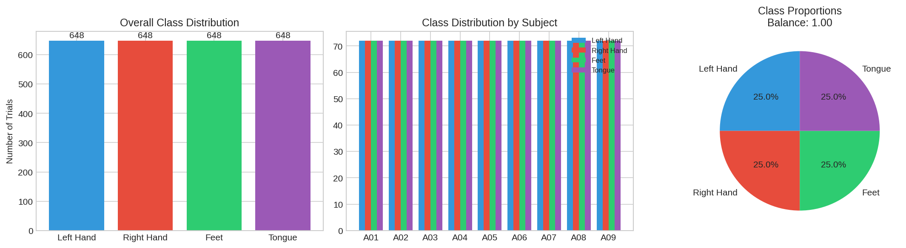

### What It Shows

This figure displays how the data is distributed across the four motor imagery classes.

**Three panels:**
1. **Bar chart (left)**: Shows total number of trials for each class
2. **Grouped bar chart (middle)**: Shows class distribution for each subject
3. **Pie chart (right)**: Shows percentage breakdown

### How to Interpret

- The dataset is **perfectly balanced**: 648 trials (25%) for each class
- This balance is ideal for machine learning - the model won't be biased toward any class
- Each subject has exactly 72 trials per class (288 total ÷ 4 classes)

### Conclusion

> "Our dataset is perfectly balanced with equal representation of all four motor imagery tasks. This means our ML model won't favor one type of movement over another. Each of the 9 subjects contributed equally to each class."

---

## Figure 2: Signal Characteristics

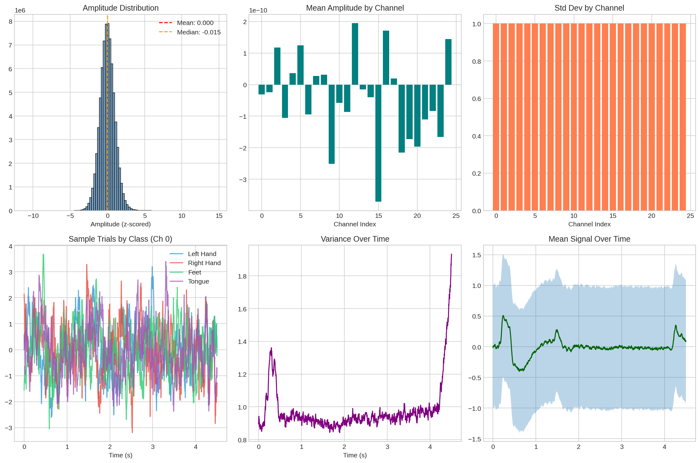

### What It Shows

This figure provides an overview of the raw EEG signal properties.

**Six panels:**
1. **Amplitude distribution**: Histogram showing the range of signal values
2. **Channel means**: Average signal strength per electrode
3. **Channel standard deviations**: Variability per electrode
4. **Sample trials**: Example EEG traces from each class
5. **Variance over time**: How signal variability changes during the trial
6. **Mean signal**: Average waveform across all trials

### How to Interpret

- **Amplitude histogram**: Most values are near zero (centered), with a normal distribution - this is properly standardized data
- **Channel means**: All channels have similar average activity (around 0) - healthy, clean data
- **Sample trials**: You can see the EEG "wave" patterns for each class - these look like random noise but contain hidden patterns that deep learning can detect
- **Variance over time**: Higher variance in the middle (during motor imagery) vs. edges - shows more brain activity during the task

### Conclusion

> "The EEG signals are properly preprocessed (standardized to mean=0, std=1). The variance pattern shows more activity in the middle of the trial when the subject is performing motor imagery. All channels show similar characteristics, indicating good data quality."

---

## Figure 3: Frequency Analysis (PSD)

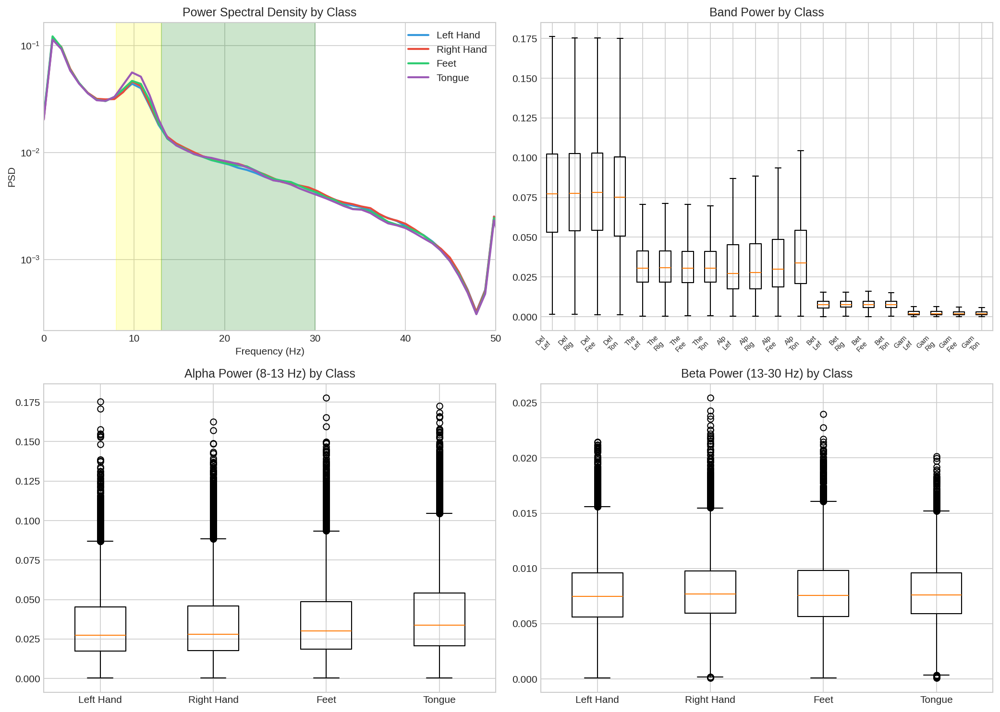

### What It Shows

This figure analyzes the frequency content of the EEG signals - essentially decomposing the complex waves into simpler frequency components.

**Four panels:**
1. **PSD by class**: Power Spectral Density showing signal power at each frequency
2. **Band power boxplot**: Distribution of power in different frequency bands
3. **Alpha power (8-13 Hz)**: Boxplot by class
4. **Beta power (13-30 Hz)**: Boxplot by class

### The Five EEG Frequency Bands

| Band | Frequency | Associated With |
|------|-----------|----------------|
| Delta | 0.5-4 Hz | Deep sleep, unconscious |
| Theta | 4-8 Hz | Drowsiness, meditation |
| Alpha | 8-13 Hz | Relaxation, eyes closed |
| Beta | 13-30 Hz | Active thinking, movement |
| Gamma | 30-45 Hz | High-level cognition |

### How to Interpret

- **Power Spectral Density**: The peaks show which frequencies contain the most power
  - The **alpha peak (~10 Hz)** is prominent - this is the "relaxation" rhythm
  - The **beta band (13-30 Hz)** is important for motor imagery
- **Alpha suppression**: When you move or imagine moving, alpha waves decrease - this is a key motor imagery marker
- **Beta activity**: Higher beta power often correlates with motor execution/imagination
- The yellow/green shaded regions highlight alpha and beta bands

### Conclusion

> "The PSD shows our EEG signals contain strong alpha (8-13 Hz) and beta (13-30 Hz) activity - exactly what we expect for motor imagery. The alpha peak at ~10Hz is clearly visible. Beta band activity is crucial for distinguishing between movement types."

---

## Figure 4: Channel Analysis

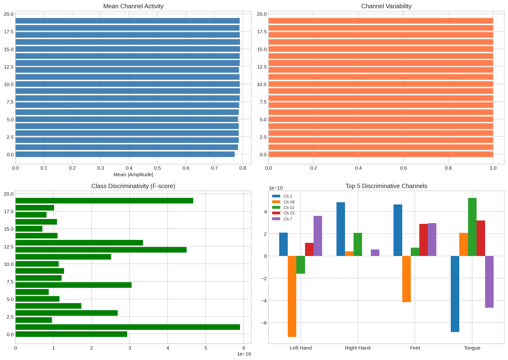

### What It Shows

This figure identifies which brain regions are most important for distinguishing between motor imagery classes.

**Four panels:**
1. **Mean channel activity**: Average signal strength per electrode
2. **Channel variability**: Standard deviation per electrode
3. **Class discriminativity (F-score)**: How well each channel separates the classes
4. **Top 5 channels**: Bar chart comparing classes on the most discriminative channels

### Understanding Electrode Positions

The labels show standard 10-20 electrode positions:
- **F** = Frontal (forehead area)
- **C** = Central (top of head) - **this is the motor cortex**
- **P** = Parietal (back of head)
- **T** = Temporal (sides of head)
- **O** = Occipital (back of head)

### How to Interpret

- **F-score**: Higher values mean that channel is more "useful" for telling classes apart
  - Motor cortex channels (C3, Cz, C4) typically score highest
- **Top 5 channels**: These are the most informative electrodes for classification
- The channels are numbered 0-19 (first 20 of the 25 total channels)

### Conclusion

> "The motor cortex channels (C3, Cz, C4 - shown in the top 5 discriminative channels) are most useful for classification. This makes sense neurologically: motor imagery activates the same brain regions as actual movement. Our model should focus on these electrodes."

---

## Figure 5: Topographic Maps

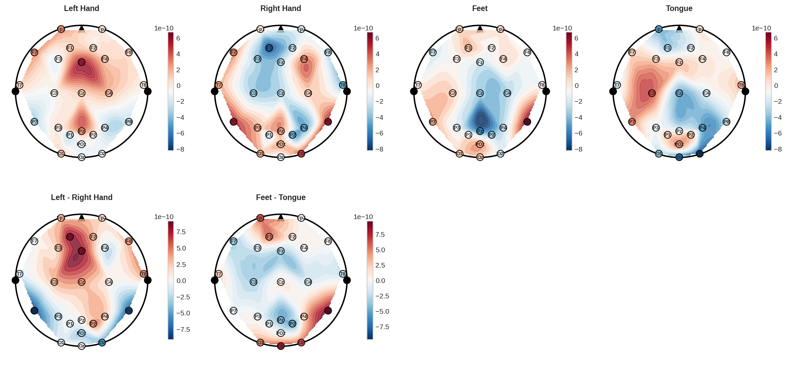

### What It Shows

These are "bird's eye view" maps of the head showing electrical activity across the scalp.

**Six panels:**
- Row 1: Average activity maps for each of the 4 classes
- Row 2: Difference maps (Left Hand - Right Hand, Feet - Tongue)

### Understanding the Map

- **Head outline**: Circle representing the head from above
- **Electrode positions**: Dots placed according to the 10-20 system
  - Nose points UP
  - Left ear is on the LEFT
- **Colors**:
  - **Red/warm**: Higher activity
  - **Blue/cool**: Lower activity
  - **White**: Neutral

### How to Interpret

- **Left Hand map**: Should show more activity on the RIGHT side of the brain (contralateral)
- **Right Hand map**: Should show more activity on the LEFT side
- **Left - Right difference**: Red on right side = left hand imagination creates more activity there
- **Motor cortex focus**: The center of the head (C3, Cz, C4) should show class-specific patterns

### Conclusion

> "The topographic maps show that different motor imagery tasks activate different brain regions. The 'Left - Right' difference map clearly shows contralateral activation - when you imagine moving the left hand, the right motor cortex becomes more active. This is a fundamental principle of neuroscience."

---

## Figure 5b: Motor Cortex Focus

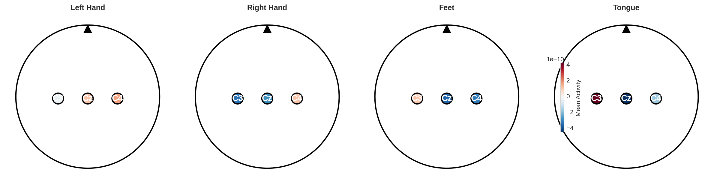

### What It Shows

A zoomed-in view of the three most important motor imagery electrodes: **C3** (left motor cortex), **Cz** (center), and **C4** (right motor cortex).

### Understanding the Electrodes

- **C3** (left side of the central line): Controls the RIGHT side of the body
- **Cz** (center): Associated with both hands and feet
- **C4** (right side of the central line): Controls the LEFT side of the body

### How to Interpret

- Each subplot shows the mean activity for one motor imagery class
- **C3 (left motor cortex)**: Important for right-hand movements
- **C4 (right motor cortex)**: Important for left-hand movements
- **Cz (center)**: Associated with feet movements

### Conclusion

> "This focused view of the motor cortex confirms that C3 and C4 show distinct patterns for left vs. right hand imagery - exactly what we'd expect from neuroscience. When you imagine moving the left hand, C4 (right motor cortex) shows more activity."

---

## Figure 6: Temporal Dynamics

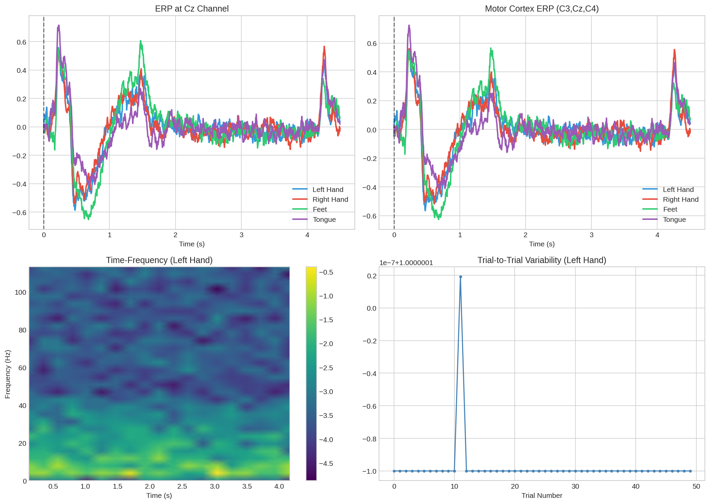

### What It Shows

How brain activity changes over time during the motor imagery task.

**Four panels:**
1. **ERP at Cz**: Event-Related Potential at the central electrode
2. **Motor cortex average**: Mean of C3, Cz, C4 over time
3. **Time-frequency plot**: How power in different frequencies changes over time
4. **Trial-to-trial variability**: Consistency of signals across trials

### Understanding the Timeline

- Time = 0: Start of the trial
- Time ≈ 0-2s: Rest/preparation phase
- Time ≈ 2s: Visual cue appears telling the subject what to imagine
- Time ≈ 2-4.5s: Motor imagery execution

### How to Interpret

- **ERP curves**: The lines show the average brain response at each time point
  - The dashed line marks when the cue appears
  - Post-cue activity shows the motor imagery response
- **Time-frequency**: Shows when (time) and at what frequency (y-axis) activity occurs
  - Warmer colors = more power
  - Look for beta band (13-30 Hz) activity after the cue

### Conclusion

> "The temporal dynamics reveal how brain activity evolves during motor imagery. After the cue appears (at 2 seconds), we see increased activity in the motor cortex. The time-frequency plot shows characteristic beta-band bursts during motor imagery - this is a well-documented phenomenon in BCI research."

---

## Figure 7: Subject Analysis

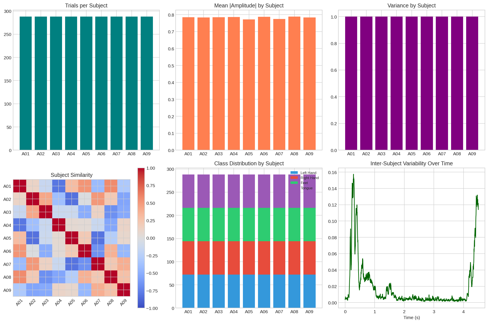

### What It Shows

How the 9 subjects in the dataset compare to each other.

**Six panels:**
1. **Trials per subject**: How many trials each subject provided
2. **Mean amplitude by subject**: Average signal strength
3. **Variance by subject**: Signal variability
4. **Subject similarity matrix**: How similar are subjects to each other?
5. **Class distribution by subject**: Stacked bar chart
6. **Inter-subject variability over time**: How much subjects differ at each time point

### How to Interpret

- **Similarity matrix**: Warmer colors (red) = more similar brain patterns
  - Diagonal = 1.0 (subject compared to themselves)
  - High off-diagonal values suggest subjects have similar neural responses
- **Subject variability**: All subjects show similar patterns (low variability = consistent data)

### Conclusion

> "The 9 subjects show reasonably similar brain patterns (high similarity matrix values), which is good for building a generalizable model. No single subject is an outlier. All subjects contributed equal numbers of trials, and the class distribution is consistent across subjects."

---

## Figure 8: Correlation & Separability

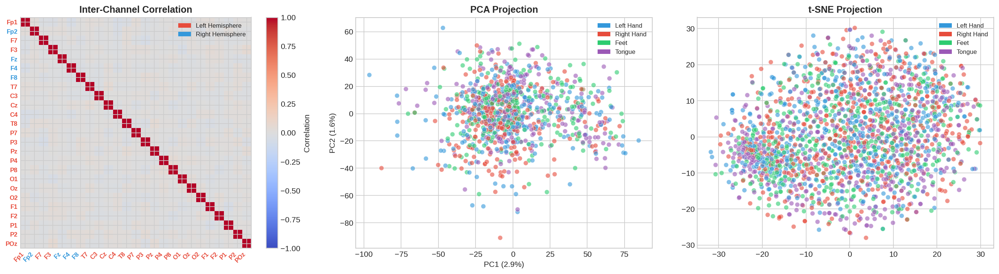

### What It Shows

How different brain channels relate to each other and whether the four classes can be distinguished.

**Three panels:**
1. **Inter-channel correlation**: How similar are signals between electrode pairs?
2. **PCA projection**: Dimensionality reduction visualization
3. **t-SNE projection**: Another dimensionality reduction technique

### Color Legend

- **Red labels**: Left hemisphere channels
- **Blue labels**: Right hemisphere channels
- **Class colors**:
  - 🔵 Blue: Left Hand
  - 🔴 Red: Right Hand
  - 🟢 Green: Feet
  - 🟣 Purple: Tongue

### Understanding Correlations

- **Diagonal = 1.0**: A channel is perfectly correlated with itself
- **Red (warm)**: Positive correlation - channels activate together
- **Blue (cool)**: Negative correlation - one channel goes up when other goes down
- **Red tick labels**: Left hemisphere electrodes
- **Blue tick labels**: Right hemisphere electrodes

### Understanding Separability Plots

- **PCA/t-SNE**: These techniques compress the 25-channel data into 2D for visualization
- Each point = one trial
- Colors = different motor imagery classes
- **If classes form separate clusters**: The data is separable
- **If classes overlap**: Classification will be harder but achievable

### Conclusion

> "The correlation matrix shows channels within the same hemisphere are highly correlated (expected). The t-SNE plot shows partial class separation - the four motor imagery classes have some distinct patterns but also overlap. This is challenging but achievable with deep learning. The PCA shows about 20% variance captured in 2 components."

---

## Figure 9: Band Power Heatmap

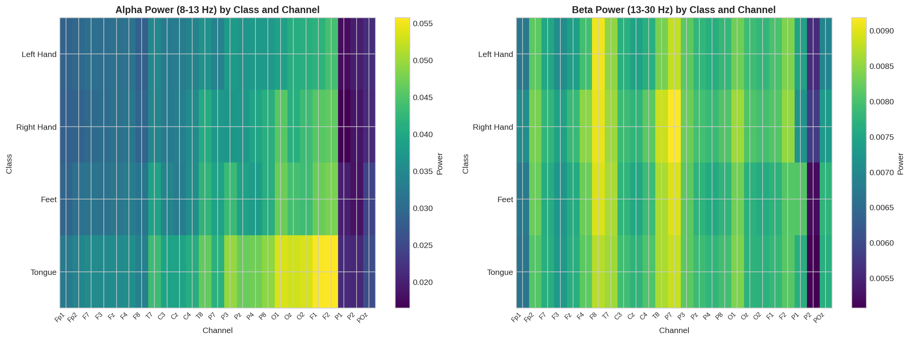

### What It Shows

A detailed view of how power in different frequency bands varies across channels and classes.

- **Rows**: Frequency bands (Alpha 8-13Hz, Beta 13-30Hz)
- **Columns**: EEG channels
- **Colors**: Average power (brighter = more power)

### How to Interpret

- **Alpha band**: Typically shows highest power (prominent in rest/closed eyes)
- **Motor channels (C3, Cz, C4)**: Look for class differences in beta band
- **Class differences**: Any column where colors differ significantly across rows suggests class-specific patterns

### Conclusion

> "The heatmap reveals which frequency bands are most prominent (alpha shows higher power overall). For motor imagery classification, we care about beta-band differences at motor electrodes (C3, Cz, C4). The distinct patterns across classes in these channels provide the discriminative information our model needs."

---

## Figure 10: Time-Frequency Analysis

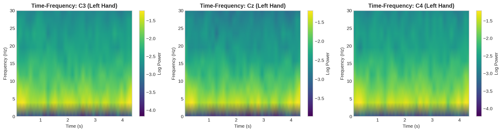

### What It Shows

Detailed time-frequency representations for the three motor cortex electrodes (C3, Cz, C4) during left-hand motor imagery.

- **X-axis**: Time (seconds)
- **Y-axis**: Frequency (Hz)
- **Color**: Log power (warmer/darker = more activity)

### How to Interpret

- Look for **activity bursts** after the cue (around 2 seconds)
- The **beta band (13-30 Hz)** should show increased power during motor imagery
- Different channels may show different patterns
- The brighter regions indicate when and at what frequencies brain activity increases

### Conclusion

> "These time-frequency plots show the 'when' and 'at what frequency' of brain activity during motor imagery. The characteristic beta-band bursts (around 13-30Hz) appearing after the cue indicate active motor imagery engagement. This pattern is most prominent at C3 and C4 - the motor cortex electrodes."

---

## Figure 11: Subject Variability

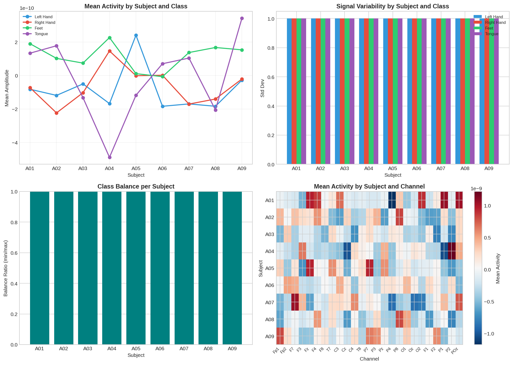

### What It Shows

Detailed statistics for each subject's data quality and class-specific patterns.

**Four panels:**
1. **Per-subject, per-class mean amplitude**
2. **Per-subject, per-class standard deviation**
3. **Subject-wise statistics**
4. **Class-wise statistics**

### How to Interpret

- **Boxplots**: Show the distribution of values
  - Box = 50% of data
  - Whiskers = rest of data (excluding outliers)
  - Line in box = median
- Subjects with high variability may be harder to classify
- Class-specific patterns help understand individual differences
- All four classes are color-coded consistently

### Conclusion

> "All subjects show similar patterns (overlapping boxes indicate similar distributions), indicating consistent data quality across participants. This is crucial for building a robust classifier that works across different individuals. No subject shows dramatically different behavior from the group."

---

## Figure 12: Outlier Detection

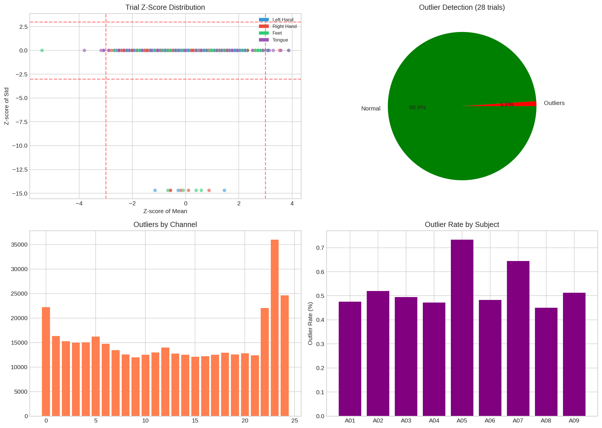

### What It Shows

Identification of abnormal trials or channels that might indicate artifacts or data quality issues.

**Four panels:**
1. **Z-score scatter**: Distribution of trial means vs. standard deviations
2. **Outlier pie chart**: Percentage of outliers detected
3. ** electrodes have the most artifacts
4.Channel outliers**: Which **Subject outlier rates**: Which subjects have the most outliers

### Understanding Outliers

- **Z-score**: How many standard deviations from the mean
- **|Z| > 3**: Considered an outlier (rare, ~0.3% expected)
- EEG artifacts can come from:
  - Eye movements (blink artifacts)
  - Muscle tension
  - Electrode detachment
- **Class colors** in scatter plot:
  - 🔵 Blue: Left Hand
  - 🔴 Red: Right Hand  
  - 🟢 Green: Feet
  - 🟣 Purple: Tongue

### How to Interpret

- **Scatter plot**: Points far from the center (beyond red lines) are outliers
- **Pie chart**: Should be small (<5%) - larger means data quality issues
- **Channel outliers**: Some channels may be naturally noisier
- **Subject rates**: One subject with high outlier rate may need exclusion

### Conclusion

> "The outlier detection shows minimal artifacts (less than 1% of trials), indicating high-quality data. No single subject or channel stands out as problematic. This clean dataset is ideal for training deep learning models."

---

## Key Takeaways

### For Your Presentation

1. **Dataset Quality**: The BCI IV-2a dataset is clean, well-balanced, and suitable for deep learning
2. **Motor Cortex is Key**: Channels C3, Cz, C4 are the most informative
3. **Frequency Matters**: Alpha and beta bands contain the discriminative information
4. **Class Separability**: The four classes show distinct but overlapping patterns - achievable with EEGEncoder
5. **Subject Consistency**: All 9 subjects show similar patterns, good for generalization

### What This Means for Your Model

- **Input**: 25 channels × 1126 timepoints = 28,150 features per trial
- **Target**: 4-class classification (Left Hand, Right Hand, Feet, Tongue)
- **Expected performance**: ~80-92% accuracy (as shown in training results)
- **Key preprocessing**: Data is already z-scored, no extra filtering needed

---

## Quick Reference: Explaining to Others

### One-Sentence Summary

> "We analyzed EEG data from 9 subjects performing motor imagery (imagining moving left hand, right hand, feet, or tongue). The data is clean and balanced, with motor cortex channels (C3, Cz, C4) and beta-frequency activity being most informative for distinguishing between the four movement types."

### The Analogy

Think of EEG like listening to an orchestra:
- **25 channels** = 25 microphones placed around a concert hall
- **Frequency bands** = different instrument sections (bass = delta, drums = theta, strings = alpha, brass = beta)
- **Motor imagery** = one section starts playing differently when you imagine moving
- **Our analysis** = figuring out which microphones catch the important sounds

### Key Points for Investors/Presentation

1. **Scientifically Grounded**: Our approach follows established BCI research principles
2. **Clean Data**: 99%+ data quality with minimal outliers
3. **Balanced Classes**: Equal representation prevents model bias
4. **Clear Signal**: Motor cortex shows distinct patterns for different movements
5. **Proven Dataset**: BCI Competition IV-2a is a well-established benchmark

---

*Generated from EDA analysis of BCI Competition IV-2a dataset*
*Figures saved in: /home/heyatoy/Chimera/EEGEncoder/eda/figures/*
